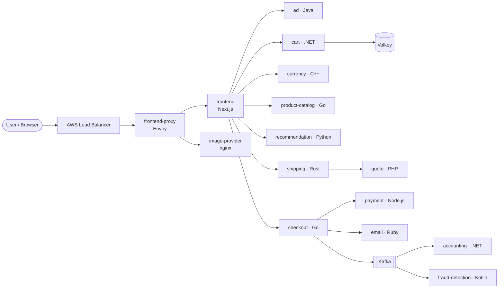

# 🔭 Astronomy Shop — End-to-End DevOps on AWS EKS


A production-style, polyglot **microservices e-commerce application** taken from source code
all the way to a running **Amazon EKS** cluster — containerised with Docker, provisioned with
Terraform, deployed with Kubernetes manifests and automated with GitHub Actions.

> Built as part of the Udemy course **“Ultimate DevOps Project and Resume Preparation”**.
> The application itself is the open-source [OpenTelemetry Astronomy Shop](https://github.com/open-telemetry/opentelemetry-demo) — see [Credits](#-credits).

**Infrastructure code (Terraform):** [avikal06/ultimate-devops-project-aws](https://github.com/avikal06/ultimate-devops-project-aws)

---

## 📐 Architecture



All services talk to each other over **gRPC** (contracts in [`pb/demo.proto`](pb/demo.proto)) and run
inside an **Amazon EKS** cluster in a custom **VPC** created with Terraform.

| Service | Language | What it does |
|---|---|---|
| frontend | TypeScript / Next.js | Storefront UI and API gateway to the backend |
| frontend-proxy | Envoy | Single entry point; routes UI, images and feature flags |
| product-catalog | Go | Product list and search |
| checkout | Go | Orchestrates cart → payment → shipping → email |
| cart | C# / .NET | Shopping cart, stored in Valkey (Redis-compatible) |
| ad | Java | Contextual ads |
| recommendation | Python | Product recommendations |
| currency | C++ | Currency conversion |
| shipping / quote | Rust / PHP | Shipping cost quotes |
| payment | Node.js | Card payment processing (demo) |
| email | Ruby | Order confirmation emails (demo) |
| accounting / fraud-detection | .NET / Kotlin | Kafka consumers for placed orders |
| load-generator | Python / Locust | Simulated user traffic |

---

## 🛠️ What DevOps does in this project

| Stage | Tooling | What I implemented |
|---|---|---|
| **Workstation** | AWS EC2 (Ubuntu), IAM | EC2 build host, dedicated IAM users instead of root credentials, security groups, EBS volume resize |
| **Build** | Go, Gradle/Java, npm | Built services from source; fixed toolchain issues (cgo headers, JDK version) |
| **Containerise** | Docker, Docker Compose | Dockerfiles per service; full stack runnable locally with Compose |
| **Provision** | Terraform | Remote state in **S3** with **DynamoDB** locking; reusable **VPC** and **EKS** modules |
| **Deploy** | Kubernetes on Amazon EKS | Deployments, Services and ServiceAccount in [`kubernetes/`](kubernetes/); storefront exposed through an AWS Load Balancer |
| **CI/CD** | GitHub Actions | [`ci.yaml`](.github/workflows/ci.yaml): build → unit tests → golangci-lint → Docker push → auto-update the image tag in the K8s manifest (GitOps style) |
| **Release** | Docker Hub | Multi-arch (amd64 + arm64) images with `docker buildx` |

### Real-world issues I solved along the way
- **EKS version retirement** — Kubernetes 1.30 and Amazon Linux 2 node AMIs were no longer offered; upgraded to **1.35** with **Amazon Linux 2023** nodes.
- **Node group stuck creating** — traced to AWS Free-plan instance-type limits; switched to an eligible type.
- **Terraform backend & provider errors** — wrong resource prefix, someone else’s S3 bucket name, lock-table mismatch, missing IAM permissions.
- **`terraform destroy` blocked** — an orphaned Kubernetes-created load balancer held public IPs in the VPC; found and removed it.
- **Secret hygiene** — `.gitignore` for state, `tfvars`, keys and credentials; repos scanned before publishing.

---

## ✨ My changes on top of the original app

- **Redesigned storefront UI** — new theme, typography, hero section, product cards, cart/checkout layout and mobile fixes ([`src/frontend`](src/frontend)). All test hooks and behaviour unchanged.
- **Custom frontend image** — published as `docker.io/avikal06/astronomy-frontend` and wired into [`kubernetes/frontend/deploy.yaml`](kubernetes/frontend/deploy.yaml) with the env vars the newer frontend expects.

---

## 🚀 Run it

### Locally with Docker Compose
```bash
docker compose up -d
```
Then open http://localhost:8080.

### On Amazon EKS
1. Provision the VPC + EKS cluster with Terraform — see [ultimate-devops-project-aws](https://github.com/avikal06/ultimate-devops-project-aws) (`eks-install/`).
2. Point `kubectl` at the cluster:
   ```bash
   aws eks update-kubeconfig --name my-eks-cluster --region us-west-2
   ```
3. Deploy everything:
   ```bash
   kubectl apply -f kubernetes/serviceaccount.yaml
   kubectl apply -f kubernetes/complete-deploy.yaml
   ```
4. Get the storefront URL:
   ```bash
   kubectl get svc opentelemetry-demo-frontendproxy
   ```

> 💸 **Clean up to avoid charges:** delete LoadBalancer services first (`kubectl delete svc --all-namespaces --field-selector spec.type=LoadBalancer`), then run `terraform destroy`.

---

## 📁 Repository layout

```
.github/workflows/   CI pipeline (GitHub Actions)
kubernetes/          Kubernetes manifests per service + complete-deploy.yaml
pb/                  gRPC / protobuf contracts
src/                 Source code and Dockerfile for every microservice
docker-compose.yml   Run the full stack locally
```

---

## 🙏 Credits

- **Application:** [OpenTelemetry Demo](https://github.com/open-telemetry/opentelemetry-demo) by the OpenTelemetry authors and contributors, licensed under [Apache 2.0](LICENSE).
- **Course:** “Ultimate DevOps Project and Resume Preparation” on Udemy.

## 👤 Author

**Har Avikal Bahadur Sinha** — DevOps & Cloud

[](https://github.com/avikal06)
